# Krusty Krab - Burger Queen (API Client)

Krusty Krab - Burguer Queen é uma aplicação web criada para administrar pedidos realizados no salão do restaurante e enviar para o preparo na cozinha. 

🍔 Desenvolvido por [Julli Mayane](https://github.com/jjullimayanne) e [Carolina Alvim](https://github.com/caroAlvim), utilizando React.

Para visualizar, acesse [aqui](https://krusty-krab-restaurant.herokuapp.com/)

 
  <h4> senhas de acesso:</h4>

 |      |          Salão          |      Cozinha            |
 |------|-------------------------|-------------------------|
 |  📨  |     saloon@mail.com     |    kitchen@mail.com     |
 |  🔐  |         1234567         |         1234567         |

 
  

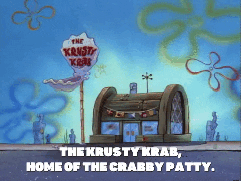

## Índice

- [1. Proposta do projeto](#1-proposta-do-projeto)
- [2. Tema escolhido](#2-tema-escolhido)
- [3. Histórias de usuário](#3-histórias-de-usuário)
- [4. Protótipo](#4-protótipo)
- [5. A aplicação](#5-a-aplicação)
- [6. tecnologias utilizadas](#6-tecnologias-utilizadas)

---

## 1. Proposta do projeto

Um pequeno restaurante de hambúrgueres, que está crescendo, necessita uma
interface em que se possa realizar pedidos utilizando um _tablet_, e enviá-los
para a cozinha para que sejam preparados de forma ordenada e eficiente.

Este projeto tem duas áreas: interface (cliente) e API (servidor). Nosso
cliente nos pediu para desenvolver uma interface que se integre com a API
que outra equipe de desenvolvedoras está trabalhando simultaneamente.

Estas são as informações que temos do cliente:

> Somos **Krusty Krab**, um fast food 24hrs.
>
> A nossa proposta de serviço 24 horas foi muito bem recebida e, para continuar a
> crescer, precisamos de um sistema que nos ajude a receber pedidos de nossos
> clientes.
>
> Nós temos 2 menus. Um muito simples para o café da manhã:
>
> | Ítem                           | Preço R$ |
> | ------------------------------ | -------- |
> | Café americano                 | 5        |
> | Café com leite                 | 7        |
> | Sanduíche de presunto e queijo | 10       |
> | Suco de fruta natural          | 7        |
>
> E outro menu para o resto do dia:
>
> | Ítem                     | Preço  |
> | ------------------------ | ------ |
> | **Hambúrgueres**         | **R$** |
> | Hambúrguer simples       | 10     |
> | Hambúrguer duplo         | 15     |
> | **Acompanhamentos**      | **R$** |
> | Batata frita             | 5      |
> | Anéis de cebola          | 5      |
> | **Bebidas**              | **R$** |
> | Água 500ml               | 5      |
> | Água 750ml               | 7      |
> | Bebida gaseificada 500ml | 7      |
> | Bebida gaseificada 750ml | 10     |
>
> **Importante:** Os clientes podem escolher entre hambúrgueres de carne bovina,
> frango ou vegetariano. Além disso, por um adicional de R\$ 1,00 , eles podem
> adicionar queijo **ou** ovo.
>
> Nossos clientes são bastante indecisos, por isso é muito comum que eles mudem o
> seu pedido várias vezes antes de finalizar.

A interface deve mostrar os dois menus (café da manhã e restante do dia), cada
um com todos os seus _produtos_. O usuário deve poder escolher que _produtos_
adicionar e a interface deve mostrar o _resumo do pedido_ com o custo total.

## 2. Tema Escolhido

Krusty Krab, ou Siri Cascudo, é um fast-food presente no desenho animado Bob Esponja. O restaurante é conhecido pelo seu famoso hamburguer, o Krabby Patty, que é alvo de espionagem industrial do concorrente Plankton. Inspiradas pelo programa, desenvolvemos esta aplicação para o gerenciamento de uma hamburgueria baseada inteiramente no cartoon e para um cliente especial, Seu Siriguejo.

 
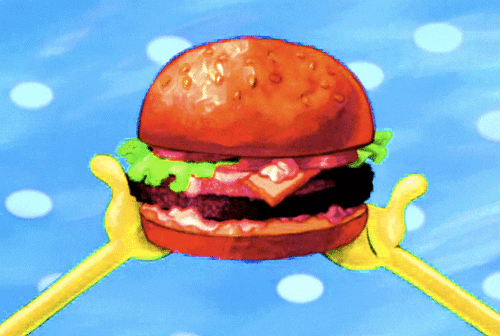

## 3. Histórias de usuário

### Definição do produto

O [_Product Owner_](https://www.youtube.com/watch?v=7lhnYbmovb4) nos apresentou
este _backlog_ que é o resultado do seu trabalho com o cliente até hoje.

---

#### [Historia de usuario 1] Garçom/Garçonete deve poder entrar no sistema, caso o admin já lhe tenha dado as credenciais

Eu, como garçom/garçonete quero entrar no sistema de pedidos.

##### Critérios de aceitação

O que deve acontecer para satisfazer as necessidades do usuário?

- Acessar uma tela de login.
- Inserir email e senha.
- Receber mensagens de erros compreensíveis, conforme o erro e as informações inseridas.
- Entrar no sistema de pedidos caso as credenciais forem corretas.

##### Definição de pronto

O acordado abaixo deve acontecer para dizer que a história está terminada:

- Você deve ter recebido _code review_ de pelo menos uma parceira.
- Fez _testes_ unitários e, além disso, testou seu produto manualmente.
- Você fez _testes_ de usabilidade e incorporou o _feedback_ do usuário.
- Você deu deploy de seu aplicativo e marcou sua versão (tag git).

---

#### [História de usuário 2] Garçom/Garçonete deve ser capaz de anotar o pedido do cliente

Eu como garçom/garçonete quero poder anotar o pedido de um cliente para não
depender da minha memória, saber quanto cobrar e poder enviar os pedidos para a
cozinha para serem preparados em ordem.

##### Critérios de aceitação

O que deve acontecer para satisfazer as necessidades do usuário?

- Anotar o nome do cliente.
- Adicionar produtos aos pedidos.
- Excluir produtos.
- Ver resumo e o total da compra.
- Enviar o pedido para a cozinha (guardar em algum banco de dados).
- Funcionar bem em um _tablet_.

##### Definição de pronto

O acordado abaixo deve acontecer para dizer que a história está terminada:

- Você deve ter recebido _code review_ de pelo menos uma parceira.
- Fez _testes_ unitários e, além disso, testou seu produto manualmente.
- Você fez _testes_ de usabilidade e incorporou o _feedback_ do usuário.
- Você deu deploy de seu aplicativo e marcou sua versão (tag git).

---

#### [História de usuário 3] Chefe de cozinha deve ver os pedidos

Eu como chefe de cozinha quero ver os pedidos dos clientes em ordem, poder
marcar que estão prontos e poder notificar os garçons/garçonetes que o pedido
está pronto para ser entregue ao cliente.

##### Critérios de aceitação

- Ver os pedidos ordenados à medida em que são feitos.
- Marcar os pedidos que foram preparados e estão prontos para serem servidos.
- Ver o tempo que levou para preparar o pedido desde que chegou, até ser marcado
  como concluído.

##### Definição de pronto

- Você deve ter recebido _code review_ de pelo menos uma parceira.
- Fez _testes_ unitários e, além disso, testou seu produto manualmente.
- Você fez _testes_ de usabilidade e incorporou o _feedback_ do usuário.
- Você deu deploy de seu aplicativo e marcou sua versão (tag git).

---

#### [Historia de usuário 4] Garçom/Garçonete deve ver os pedidos prontos para servir

Eu como garçom/garçonete quero ver os pedidos que estão prontos para entregá-los
rapidamente aos clientes.

##### Critérios de aceitação

- Ver a lista de pedidos prontos para servir.
- Marcar os pedidos que foram entregues.

##### Definição de pronto

- Você deve ter recebido _code review_ de pelo menos uma parceira.
- Fez _testes_ unitários e, além disso, testou seu produto manualmente.
- Você fez _testes_ de usabilidade e incorporou o _feedback_ do usuário.
- Você deu deploy de seu aplicativo e marcou sua versão (tag git).
- Os dados devem ser mantidos intactos, mesmo depois que um pedid

## 4. Protótipo

Paleta de cores

 
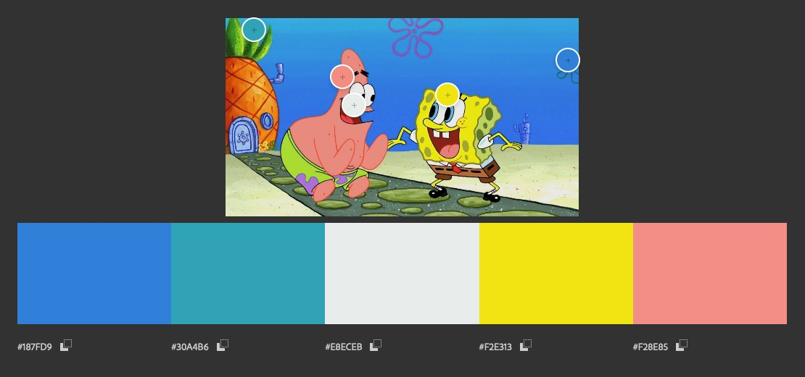

#### Outras inspirações

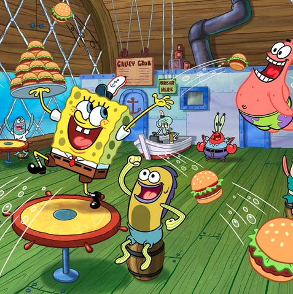 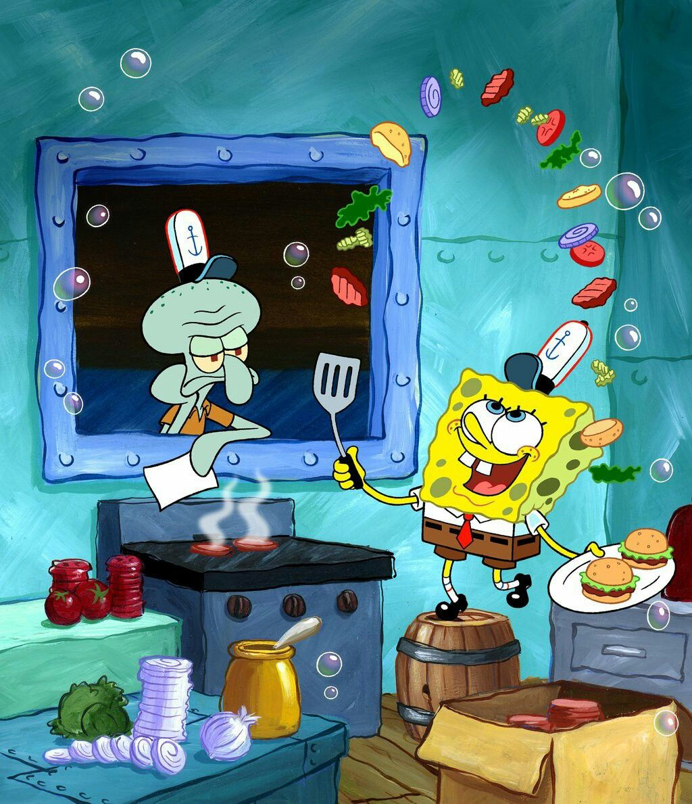 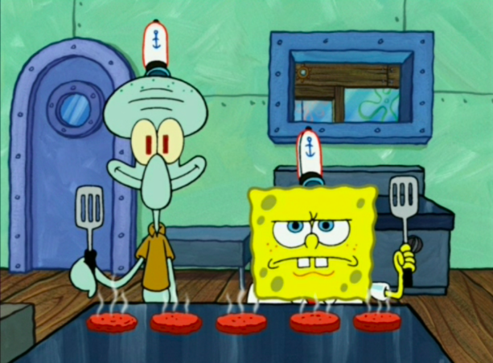

## 5. A aplicação

Desenvolvido para Tablet

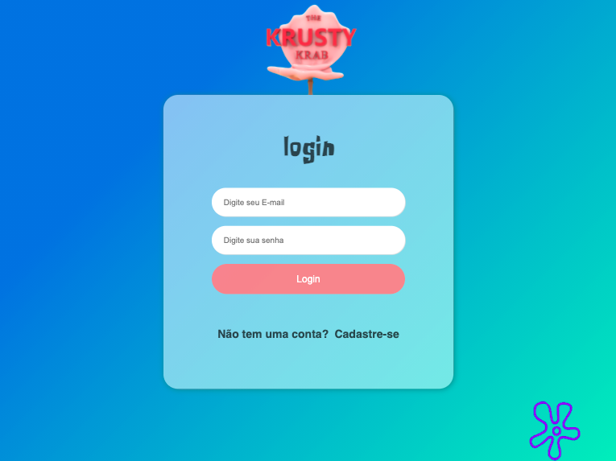
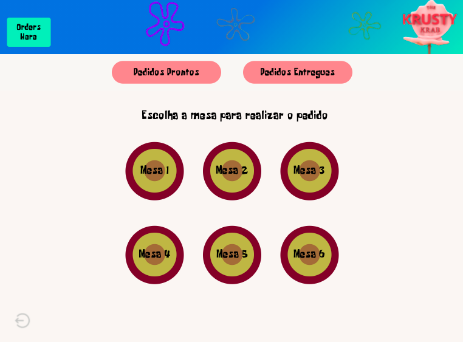
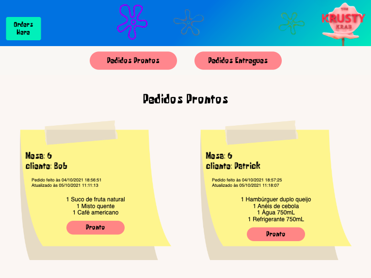
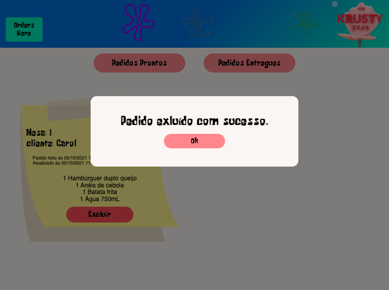
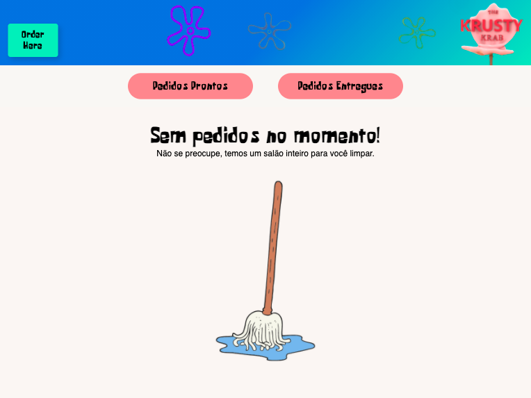
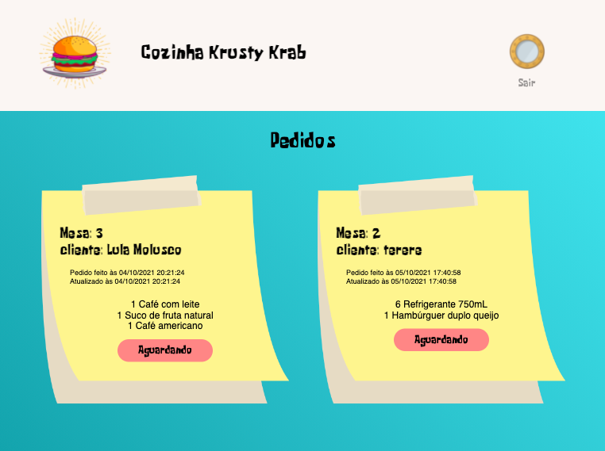

## 6. Tecnologias utilizadas

  <a href="https://github.com/caroAlvim">

  

 
  
  
  
  
  
  
  
  
  
  

 

## 

<h4> Volte sempre </h4> 

